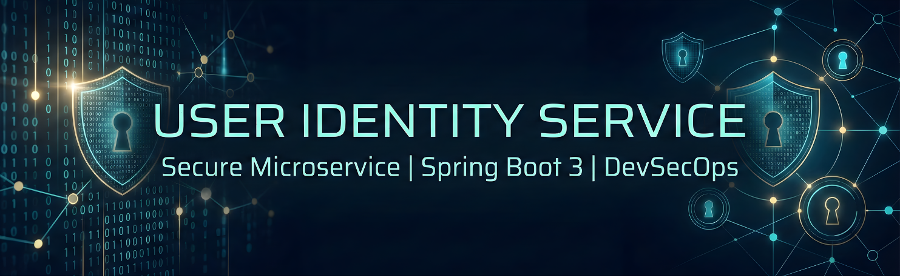
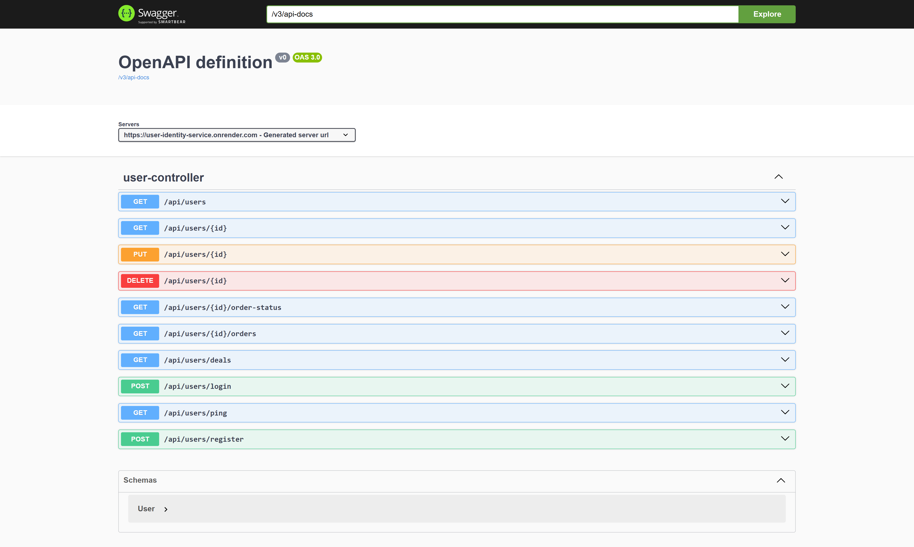
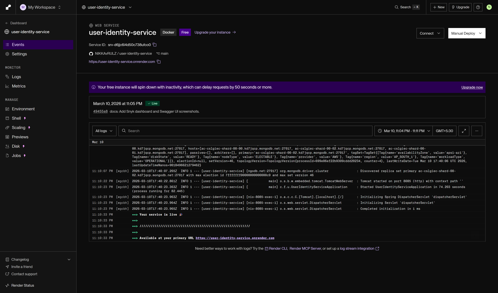

# User Identity Service 🛡️

Part of the **Food Ordering System** Microservices Project for SLIIT Cloud Computing.

## 🚀 Overview
The User Identity Service is a Spring Boot-based microservice responsible for user authentication, registration, and profile management. It serves as the security gateway for the overall application.

## 🌐 Live Deployment
* **Base URL:** [https://user-identity-service.onrender.com](https://user-identity-service.onrender.com)
* **API Documentation (Swagger):** [Explore Endpoints](https://user-identity-service.onrender.com/swagger-ui/index.html)

---

## 📸 Project Screenshots

<b>1. Working Prototype: Live Swagger UI</b> (Expand)

 
  
 *(Note: Replace with your actual screenshot)*
* This screenshot shows the live, interactive Swagger UI documentation for the User Identity Service. It allows you to test the registration, login, and user profile endpoints directly in your browser.

<b>2. DevSecOps: Snyk Vulnerability Scan</b> (Expand)

 
  
 *(Note: Replace with your actual screenshot)*
* This screenshot from the Snyk dashboard confirms that the project's `pom.xml` and `Dockerfile` have been scanned. It shows **2 High Severity** findings that are documented for risk mitigation in the final project report.

<b>3. Managed Orchestration: Render Deployment Status</b> (Expand)

 
  
 *(Note: Replace with your actual screenshot)*
* This screenshot confirms that the User Identity Service is **Live** and running on **Render's managed cloud environment**. It successfully binds to port **8080** and has completed the deployment pipeline.

---

## 🛠️ Tech Stack
* **Framework:** Spring Boot 3
* **Database:** H2 In-Memory Database
* **Containerization:** Docker (Multi-stage build)
* **CI/CD:** GitHub Actions
* **Cloud Hosting:** Render
* **Security Scanning:** Snyk (DevSecOps)

## 📦 Features
- **User Registration:** `POST /api/users/register`
- **User Login:** `POST /api/users/login`
- **User Verification:** `GET /api/users/{id}` (Used by Order Management Service)

## 🏗️ DevOps & Deployment
This service implements a full CI/CD pipeline:
1. **Build:** Maven builds the JAR inside a Docker container.
2. **Scan:** Snyk performs a SAST scan on dependencies and the Dockerfile.
3. **Push:** The verified image is pushed to Docker Hub.
4. **Deploy:** Render automatically pulls the latest image and deploys it to the cloud.

## 🧪 Running Locally
1. Clone the repository: `git clone https://github.com/NIKKAvRULZ/user-identity-service.git`
2. Run Maven build: `mvn clean package`
3. Run the application: `java -jar target/*.jar`
4. Access Swagger at: `http://localhost:8080/swagger-ui/index.html`

## 🛡️ Security Findings
During development, **Snyk** identified 2 high-severity vulnerabilities in the project's dependencies and base image. These findings are documented in the project report for risk assessment.
